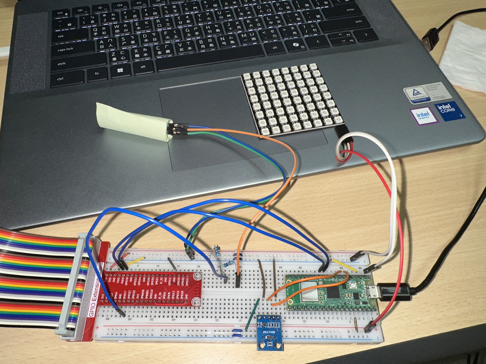

# Smart Space Lighting System

This project is a smart lighting subsystem for a shared smart space prototype.  
The initial version focuses on building a minimal control pipeline between Raspberry Pi 4 and Pico W through UART and Linux device files.


## Preview

### v1 Hardware Prototype

Initial breadboard prototype used for UART communication testing and WS2812B LED control.




## Features

- Terminal-based manual lighting control
- UART communication between Pico W and Raspberry Pi 4
- Linux device nodes for sensor and lighting control
- User-space daemon for monitoring sensor data
- Initial ACTIVE / IDLE / SLEEP state control logic

## Tech Stack

- C
- Linux Kernel Module
- Raspberry Pi 4
- Pico W
- UART
- Linux device file interface

## 📁 Project Structure

```text
smart-space-lighting-system/
├── firmware/
│   └── pico/
│       ├── CMakeLists.txt
│       ├── main.c
│       └── ws2812.pio
│
├── linux/
│   ├── daemon/
│   │   └── lighting_daemon.c
│   │
│   └── kernel-module/
│       ├── uart_hub_km/
│       │   ├── Makefile
│       │   └── uart_hub.c
│       │
│       └── presence_km/
│           ├── Makefile
│           └── presence.c
│
├── .gitignore
├── .gitattributes
└── README.md
```
- `firmware/pico/`: Pico W firmware for UART command parsing and WS2812 LED control
- `linux/kernel-module/uart_hub_km/`: UART kernel module exposing `/dev/light_sensor` and `/dev/lighting`
- `linux/kernel-module/presence_km/`: PIR presence detection kernel module
- `linux/daemon/`: user-space daemon for sensor monitoring and state control

## ▶️ How to Run (v1)

This version is designed to run on Raspberry Pi 4 and Pico W.  
The main goal is to validate the UART-based control pipeline between Linux user space, Linux kernel modules, and embedded firmware.


### 1. Build and flash Pico W firmware

The Pico W firmware is located in:

```text
firmware/pico/
```

Build the firmware with the Pico SDK:

```bash
cd firmware/pico
mkdir build
cd build
cmake ..
make
```

After building, flash the generated `.uf2` file to Pico W.


### 2. Build Linux kernel modules

The Linux kernel modules are located in:

```text
linux/kernel-module/
```

Build and insert the UART hub kernel module:

```bash
cd linux/kernel-module/uart_hub_km
make
sudo insmod uart_hub.ko
```

Build and insert the presence detection kernel module:

```bash
cd ../presence_km
make
sudo insmod presence.ko
```

Check whether the device nodes are created:

```bash
ls /dev/light_sensor
ls /dev/lighting
ls /dev/presence
```


### 3. Build user-space daemon

The daemon is located in:

```text
linux/daemon/
```

Build it with GCC:

```bash
cd linux/daemon
gcc -o lighting_daemon lighting_daemon.c
```


### 4. Run daemon

Run the daemon with root permission:

```bash
sudo ./lighting_daemon
```

The daemon monitors sensor data and sends state commands to Pico W through `/dev/lighting`.


### 5. Test manual lighting control

You can manually send commands to the lighting device node:

```bash
echo "STATE:ACTIVE" | sudo tee /dev/lighting
echo "STATE:IDLE" | sudo tee /dev/lighting
echo "STATE:SLEEP" | sudo tee /dev/lighting
```


### 6. Read sensor data

Read ambient light data:

```bash
cat /dev/light_sensor
```

Read presence status:

```bash
cat /dev/presence
```

Expected output examples:

```text
LUX:120.5
```

```text
1
```


### Notes

- `/dev/light_sensor` provides LUX data received from Pico W through UART.
- `/dev/lighting` is used to send lighting state commands back to Pico W.
- `/dev/presence` provides PIR sensor status from the Raspberry Pi GPIO.
- This v1 version focuses on terminal-based control and system pipeline validation.

---

## 中文說明

本專案為共享智慧空間原型中的智慧燈光子系統。  
初始版本著重於建立 Raspberry Pi 4 與 Pico W 之間的最小控制流程，透過 UART 與 Linux 裝置檔完成燈光控制與感測資料傳遞。

## 功能

- 終端機手動控制燈光
- Pico W 與 Raspberry Pi 4 之間的 UART 通訊
- 透過 Linux 裝置節點進行感測資料讀取與燈光控制
- 使用 user-space daemon 監控感測資料
- 初步 ACTIVE / IDLE / SLEEP 狀態控制邏輯

## 使用技術

- C
- Linux Kernel Module
- Raspberry Pi 4
- Pico W
- UART
- Linux 裝置檔介面
