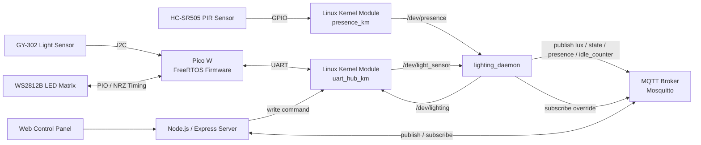
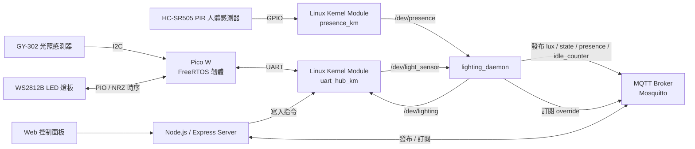

# Smart Space Lighting System

A smart lighting subsystem for a shared smart space prototype.  
This project integrates Raspberry Pi 4, Pico W, Linux kernel modules, FreeRTOS firmware, MQTT, and a Node.js web dashboard.

The system was developed in stages.  
The initial version focused on building a minimal UART-based control pipeline, while the second version extends the system with FreeRTOS task scheduling, MQTT-based status publishing, and a web-based control panel.

## Demo

### v2 — MQTT Dashboard Integration

Integrated smart lighting subsystem with FreeRTOS firmware, MQTT status publishing, web-based control, and real-time system monitoring.


🎥 Demo Video: [Watch v2 Demo](https://youtu.be/-QJoQXVqg9Y?si=haEGasTD7JBurA3a)


## Features

- Auto lighting control based on presence detection and accumulated idle time
- Terminal-based manual lighting control in v1
- Web-based manual lighting control in v2
- UART communication between Raspberry Pi 4 and Pico W
- Linux device nodes for sensor data and lighting control
- MQTT-based status publishing
- Node.js / Express web control dashboard
- ACTIVE / IDLE / SLEEP state control logic
- FreeRTOS-based Pico W firmware for concurrent sensing, command handling, and LED control


## Tech Stack

- C / Embedded C
- Linux Kernel Module
- FreeRTOS
- Raspberry Pi 4
- Pico W
- UART
- GPIO Interrupt
- MQTT / Mosquitto
- Node.js / Express
- HTML / CSS / JavaScript
- WS2812B LED Matrix
- GY-302 Light Sensor Module (BH1750-based)
- HC-SR505 PIR Sensor


## System Architecture




## Project Structure

```text
smart-space-lighting-system/
├── firmware/
│   └── pico/
│       ├── CMakeLists.txt
│       ├── FreeRTOSConfig.h
│       ├── FreeRTOS-Kernel/
│       ├── main.c
│       └── ws2812.pio
│
├── linux/
│   ├── daemon/
│   │   └── lighting_daemon.c
│   │
│   └── kernel-module/
│       ├── uart_hub_km/
│       │   ├── Makefile
│       │   └── uart_hub.c
│       │
│       └── presence_km/
│           ├── Makefile
│           └── presence.c
│
├── web/
│   ├── server.js
│   └── public/
│       └── index.html
│
├── .gitignore
├── .gitattributes
└── README.md
```

- `firmware/pico/`: Pico W firmware with FreeRTOS tasks, GY-302 sensing, UART command parsing, and WS2812B LED control
- `linux/kernel-module/uart_hub_km/`: UART kernel module exposing `/dev/light_sensor` and `/dev/lighting`
- `linux/kernel-module/presence_km/`: PIR presence detection kernel module exposing `/dev/presence`
- `linux/daemon/`: user-space daemon for state decision, device monitoring, and MQTT publishing
- `web/`: Node.js / Express web dashboard for manual control and real-time status display


## Data Flow

### Auto Mode

1. Pico W reads ambient light data from GY-302.
2. Pico W sends LUX data to Raspberry Pi 4 through UART.
3. `uart_hub_km` receives UART data and exposes it through `/dev/light_sensor`.
4. `lighting_daemon` reads:
   - `/dev/light_sensor`
   - `/dev/presence`
5. The daemon determines system state based on accumulated idle time:
   - `ACTIVE`
   - `IDLE`
   - `SLEEP`
6. The daemon sends state commands to Pico W through `/dev/lighting`.
7. The daemon publishes status data to MQTT:
   - `smartspace/lighting/lux`
   - `smartspace/lighting/state`
   - `smartspace/lighting/presence`
   - `smartspace/lighting/idle_counter`
8. The web dashboard displays real-time lighting and presence status.


### Manual Mode

1. User switches to manual mode on the web dashboard.
2. Node.js server publishes override state through MQTT.
3. `lighting_daemon` receives the override topic and pauses automatic state decision.
4. User selects color or brightness on the web dashboard.
5. Node.js server writes lighting commands to `/dev/lighting`.
6. `uart_hub_km` transmits commands to Pico W through UART.
7. Pico W updates the WS2812B LED matrix.


## System Evolution

### v1 — UART-based Minimal Control

The first version focused on validating the basic control pipeline between Raspberry Pi 4 and Pico W.

- UART communication between Raspberry Pi 4 and Pico W
- Linux kernel module exposing `/dev/light_sensor` and `/dev/lighting`
- Terminal-based manual control using `echo`
- User-space daemon for sensor monitoring and state control
- Initial ACTIVE / IDLE / SLEEP state logic

Example:

```bash
echo "STATE:ACTIVE" | sudo tee /dev/lighting
```


### v2 — MQTT Dashboard Integration

The second version extends the system with FreeRTOS, MQTT, and a web-based control panel.

- Added FreeRTOS task scheduling on Pico W
- Added MQTT status publishing from `lighting_daemon`
- Added Node.js / Express web control dashboard
- Added manual / auto mode switching through the web UI
- Added real-time status display for LUX, PIR, state, and idle counter
- Kept UART as the device-level communication path between Raspberry Pi 4 and Pico W


## Key Components

### Pico W Firmware

The Pico W firmware is responsible for LED control and sensor handling.

Main responsibilities:

- Read ambient light data from GY-302
- Control WS2812B LED matrix using PIO
- Parse UART commands from Raspberry Pi 4
- Execute FreeRTOS tasks for:
  - LUX sensing
  - UART command receiving
  - Lighting control
  - Heartbeat/status reporting


### Linux Kernel Module: `uart_hub_km`

This kernel module provides UART-based communication between Raspberry Pi 4 and Pico W.

It exposes:

- `/dev/light_sensor`: read LUX data from Pico W
- `/dev/lighting`: send lighting commands to Pico W

Main features:

- Character device driver
- UART RX handling through kernel thread
- Blocking read with wait queue
- Device node abstraction for user-space programs


### Linux Kernel Module: `presence_km`

This kernel module handles PIR presence detection.

It exposes:

- `/dev/presence`

Main features:

- GPIO interrupt handling
- Debounce mechanism
- `poll()` support for event-driven design
- Real-time presence status access from user space


### User-space Daemon: `lighting_daemon`

The daemon acts as the system decision layer.

Main responsibilities:

- Read LUX data from `/dev/light_sensor`
- Read PIR status from `/dev/presence`
- Calculate accumulated idle time
- Determine ACTIVE / IDLE / SLEEP state
- Send state commands to Pico W through `/dev/lighting`
- Publish system status through MQTT
- Subscribe to manual override topic from the web server


### Web Control Panel

The web dashboard provides manual control and real-time status display.

Main features:

- Auto / manual mode switching
- Preset color selection
- Custom RGB and brightness control
- LUX display
- PIR status display
- ACTIVE / IDLE / SLEEP state display
- Idle counter progress display


## MQTT Topics

| Topic | Direction | Description |
|---|---|---|
| `smartspace/lighting/lux` | daemon → broker | Ambient light value |
| `smartspace/lighting/state` | daemon → broker | Current system state |
| `smartspace/lighting/presence` | daemon → broker | PIR presence status |
| `smartspace/lighting/idle_counter` | daemon → broker | Accumulated no-presence time |
| `smartspace/lighting/override` | server → broker → daemon | Manual override mode |


## How to Run (v2)

### 1. Build and flash Pico W firmware

```bash
cd firmware/pico
mkdir build
cd build
cmake ..
make
```

Flash the generated `.uf2` file to Pico W.


### 2. Build Linux kernel modules

Build and insert the UART hub kernel module:

```bash
cd linux/kernel-module/uart_hub_km
make
sudo insmod uart_hub.ko
```

Build and insert the presence detection kernel module:

```bash
cd ../presence_km
make
sudo insmod presence.ko
```

Check whether device nodes are created:

```bash
ls /dev/light_sensor
ls /dev/lighting
ls /dev/presence
```


### 3. Start MQTT broker

Install and start Mosquitto:

```bash
sudo apt install mosquitto mosquitto-clients
sudo systemctl start mosquitto
```

Optional: check broker status.

```bash
sudo systemctl status mosquitto
```


### 4. Build and run daemon

```bash
cd linux/daemon
gcc -o lighting_daemon lighting_daemon.c -lmosquitto
sudo ./lighting_daemon
```


### 5. Run web server

```bash
cd web
npm install express mqtt
node server.js
```

Open the web dashboard:

```text
http://localhost:3000
```


## Notes

- v2 keeps UART as the device-level communication path between Raspberry Pi 4 and Pico W.
- MQTT is used for status publishing, manual override, and web dashboard integration.
- `/dev/light_sensor` and `/dev/lighting` are still provided by `uart_hub_km`.
- `/dev/presence` is provided by `presence_km`.
- The pure MQTT device-control version is planned as a later version.


## Future Work

### Multi-Sensor Fusion for Presence Detection

The current system relies mainly on a single PIR sensor for presence detection.  
However, PIR sensors can produce false negatives when users remain still for a long time, or false positives caused by environmental noise.

To improve detection accuracy, the system can be extended with multi-sensor fusion.

Planned improvements:

- Integrate CO2 sensing
  - Use CO2 concentration as an indirect indicator of room occupancy
  - Improve detection reliability when users are sitting still

- Add entrance event detection
  - Use door or entry events to estimate people entering or leaving the room
  - Combine entrance events with PIR and CO2 data for better occupancy estimation

Expected benefits:

- Reduce false absence detection
- Improve ACTIVE / IDLE / SLEEP state accuracy
- Make the lighting system more reliable for shared study rooms and meeting spaces
- Prepare the system for more advanced smart-space automation

---

## 中文說明

本專案為共享智慧空間原型中的智慧燈光子系統。  
系統整合 Raspberry Pi 4、Pico W、Linux Kernel Module、FreeRTOS、MQTT 與 Node.js Web 控制介面。

專題採分階段開發。  
第一版先建立 UART 與 Linux 裝置檔的最小控制流程，第二版則加入 FreeRTOS、MQTT 狀態發布與 Web 控制面板。


## 功能

- 根據人體感測與累積無人時間進行自動燈光控制
- v1 支援終端機手動控制
- v2 支援 Web 控制面板手動控制
- Raspberry Pi 4 與 Pico W 之間使用 UART 通訊
- 使用 Linux 裝置節點進行感測資料讀取與燈光控制
- 使用 MQTT 發布系統狀態
- 使用 Node.js / Express 建立 Web 控制面板
- ACTIVE / IDLE / SLEEP 狀態控制邏輯
- Pico W 使用 FreeRTOS 處理感測、指令接收與燈光控制


## 系統架構




## 資料流程

### 自動模式

1. Pico W 讀取 GY-302 的環境光資料。
2. Pico W 透過 UART 將 LUX 資料傳送至 Raspberry Pi 4。
3. `uart_hub_km` 接收 UART 資料，並透過 `/dev/light_sensor` 提供給 user space。
4. `lighting_daemon` 讀取：
   - `/dev/light_sensor`
   - `/dev/presence`
5. daemon 根據累積無人時間判斷系統狀態：
   - `ACTIVE`
   - `IDLE`
   - `SLEEP`
6. daemon 透過 `/dev/lighting` 將狀態指令送回 Pico W。
7. daemon 透過 MQTT 發布系統狀態：
   - `smartspace/lighting/lux`
   - `smartspace/lighting/state`
   - `smartspace/lighting/presence`
   - `smartspace/lighting/idle_counter`
8. Web 控制面板顯示即時燈光與人體感測狀態。


### 手動模式

1. 使用者在 Web 控制面板切換至手動模式。
2. Node.js server 透過 MQTT 發布 override 狀態。
3. `lighting_daemon` 接收到 override topic 後，暫停自動狀態決策。
4. 使用者在 Web 控制面板選擇顏色或亮度。
5. Node.js server 將燈光指令寫入 `/dev/lighting`。
6. `uart_hub_km` 透過 UART 將指令送至 Pico W。
7. Pico W 更新 WS2812B LED 燈板。


## 系統演進

### v1 — UART 基礎控制版本

第一版主要目標是驗證 Raspberry Pi 4 與 Pico W 之間的基本控制流程。

- UART 通訊
- Linux Kernel Module 提供 `/dev/light_sensor` 與 `/dev/lighting`
- 透過 terminal `echo` 手動控制燈光
- user-space daemon 監控感測資料與控制狀態
- 初步 ACTIVE / IDLE / SLEEP 狀態邏輯


### v2 — MQTT 與 Web 控制整合版本

第二版加入 FreeRTOS、MQTT 與 Web 控制面板。

- Pico W 使用 FreeRTOS 進行多任務排程
- `lighting_daemon` 透過 MQTT 發布狀態
- 使用 Node.js / Express 建立 Web 控制面板
- Web UI 支援自動 / 手動模式切換
- 顯示 LUX、PIR、系統狀態與累積無人時間
- 此版本仍保留 UART 作為 Raspberry Pi 4 與 Pico W 之間的裝置層通訊方式


## 未來展望

### 多感測器融合的人員偵測

目前系統主要依賴單一 PIR 感測器判斷是否有人。  
但 PIR 在使用者長時間靜止時可能出現誤判，也可能受到環境干擾產生不穩定訊號。

未來可加入多感測器融合機制，提高人員偵測準確度。

預計改善方向：

- 整合 CO2 感測
  - 透過 CO2 濃度作為空間內是否有人停留的間接判斷依據
  - 改善使用者久坐不動時 PIR 無法持續偵測的問題

- 加入門口事件偵測
  - 透過門口進出事件估計人員進出狀況
  - 結合 PIR、CO2 與進出事件，提高 occupancy estimation 的可靠度

預期效益：

- 降低「人在但系統判斷無人」的誤判
- 提升 ACTIVE / IDLE / SLEEP 狀態判斷準確度
- 讓系統更適合共享自習室與會議室場景
- 為後續智慧空間自動化打下基礎
